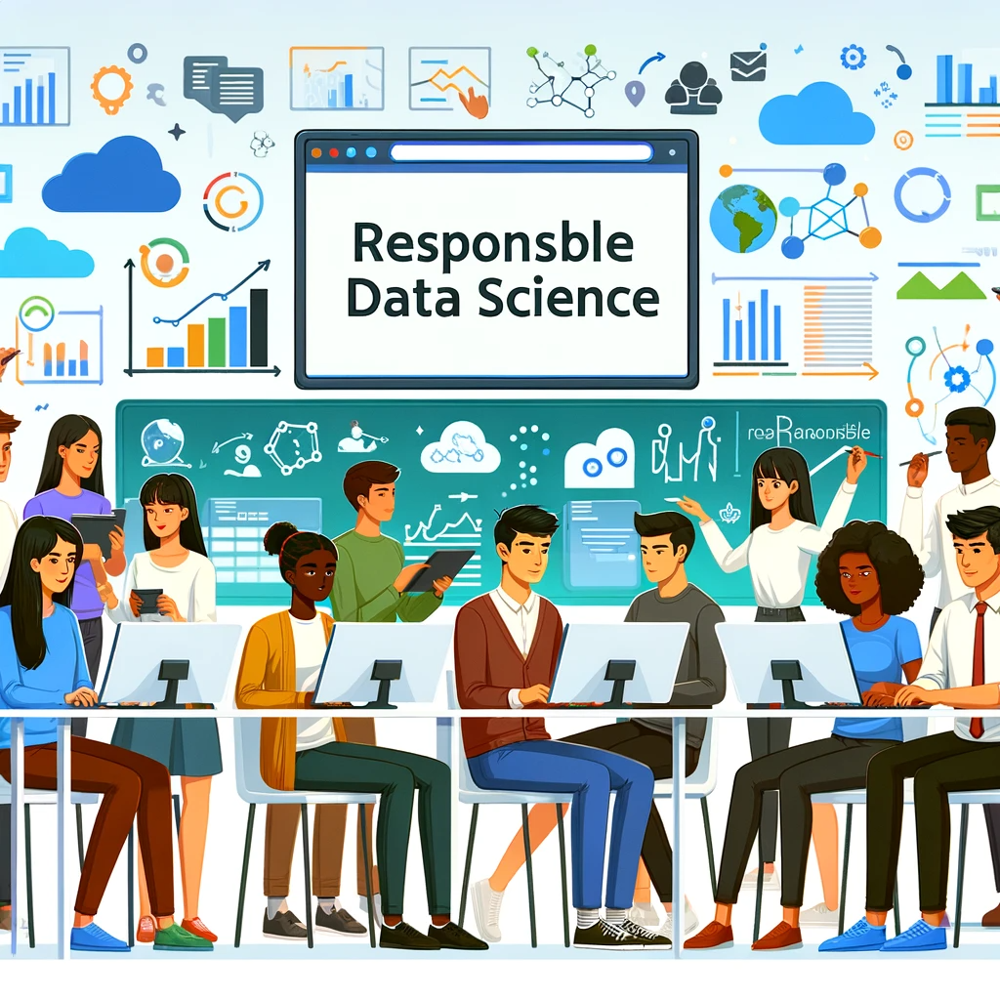

# DSC 261: Responsible Data Science 

## Description:

This course delves into Responsible Data Science, emphasizing the importance of conscientious practices in data analysis and application. It commences with Causal Inference, enabling students to distinguish between correlation and causation for accurate data interpretation. Subsequent modules cover Algorithmic Fairness to promote unbiased AI development, and Explainable AI, which aims to enhance the transparency and reliability of AI outputs. The curriculum concludes with Data Cleaning, Profiling, and Debiasing, where students learn to refine data quality and mitigate inherent biases. The course is tailored for those seeking to apply data science principles responsibly in practical scenarios.

## Instructional team:

**Instructor:**

[Babak Salimi](https://bsalimi.github.io/), bsalimi@ucsd.edu

**Course Assistants:**

Baharan Khatami, [skhatami@ucsd.edu](mailto:skhatami@ucsd.edu)  

Jiongli Zhu, [jiz143@ucsd.edu](mailto:jiz143@ucsd.edu)   

Parjanya Prashant, [pprashant@ucsd.edu](mailto:pprashant@ucsd.edu)  

**Lectures**:

Tuesdays and Thursdays at	5:00pm-6:20pm

**Office Hours:**
Baharan Khatami: Mon 15:00-16:00. [Zoom link](https://ucsd.zoom.us/j/3995044290?pwd=YTVPeXRsVTU2aEJ6WEc4OERHTHVZQT09)
Jiongli Zhu: Thu 10:00-11:00am. [Zoom link](https://ucsd.zoom.us/my/jionglizhu)   
Parjanya Prashant: Wed 13:00-14:00. [Zoom link](https://ucsd.zoom.us/j/2410312532)

**Note:** Office hours will be held via Zoom (link can be found on the Canvas calendar). 

## Course Workload

In this course, students will engage in a project-based learning experience, emphasizing teamwork, practical application of data science techniques, and effective communication. Groups of 2-3 students will collaborate to develop projects on topics relevant to the class. These projects can range from open-ended research that could potentially lead to a paper to the implementation and analysis of algorithms, building tools with GUIs for applications in responsible data science, or analyzing real and synthetic datasets. The focus is on applying responsible data science methodologies to real-world problems and data scenarios, rather than just reading papers or writing surveys.

The course will have three checkpoints: an initial proposal, a midterm update, and a final report. Students are encouraged to meet with the instructor regularly for guidance. The project will culminate in a short in-class presentation. Evaluation will consider the team's effort, the results, the quality of the related work survey, and the effectiveness of their presentation and final report. Students will also participate in peer reviews, offering and receiving constructive feedback. To enhance the learning experience, students will create visual posters and dynamic presentations, aiming to foster a deep understanding of responsible data science. For detailed project ideas and refer to the provided [Google Docs](https://docs.google.com/document/d/1kHHP4fdphdSLMjyppPO7sn2Ux_j_9ABr3q-u447_GrU/edit?usp=sharing).

## Project Timeline

### Week 1: Project Kickoff
- **Activities**: Introduction to course and project guidelines. Begin forming teams.

### Week 2: Team Formation and Topic Selection
- **Activities**: Finalize teams [here](https://forms.gle/Cwzqtrn5reG9K2pt8). Select project topics and submit initial ideas for approval.

### Week 3: Project Proposal Development
- **Activities**: Develop and refine project proposals. Closely work with TAs for brainstorming. Outline objectives, methodologies, and expected outcomes.

### Week 4: Proposal Submission and Feedback
- **Activities**: Submit detailed project proposals. Receive feedback from the TAs and make necessary adjustments.

### Week 5-8: Project Execution Begins
- **Activities**: Start executing the project according to the plan. Focus on data collection and initial analysis.

### Week 9-10: Project Presentation
- **Activities**: Finalize project outcomes. Prepare demonstration models and poster presentations.

## Grading Criteria

- **Project Proposal:** 10%
- **Execution:** 30%
- **Demonstration:** 15%
- **Presentation:** 15%
- **Class Participation:** 10%
- **Final Exam:** 20%

## **Calender:**

**(subject to change)**

# Course Calendar: 

| Week | Date               | Lecture Topics                         | Slides       | Readings                            |
|------|---------------------|----------------------------------------|--------------|------------------------------------|
| 1    | Jan 9     | Course Overview, Introduction to Causal Inference | [Slides](https://drive.google.com/file/d/13kVyZhSuy4AlyiAFjEL75dD9Gpl3QWCR/view?usp=sharing) [Slides](https://drive.google.com/file/d/13kVyZhSuy4AlyiAFjEL75dD9Gpl3QWCR/view?usp=sharing) | [Understanding Simpson’s Paradox](https://ftp.cs.ucla.edu/pub/stat_ser/r414.pdf)     |
| 2    | Jan 15      | Potential Outcome, Structural Causal Models                         |[Slides](https://drive.google.com/file/d/1fZh1nZzhHXOh7bxAUg-MV9u_x1aAuHMO/view?usp=drive_link) [Slides](https://drive.google.com/file/d/1vH04doINdgCGPN-bqc2pETRKESubdo94/view?usp=drive_link)              |    [d-Separation Without Tears](http://bayes.cs.ucla.edu/BOOK-09/ch11-1-2-final.pdf)                                 |
| 3    | Jan 22      | Project Brainstorming                  |              |                                    |
| 4    | Jan 29       | Structural Causal Models, Identification           |   [Slides](https://drive.google.com/file/d/1i-0G6tH7FYiGfVbuiaNzGDEIl3xBUHHg/view?usp=sharing )  [Recording](https://drive.google.com/file/d/1z6BRUWoWf4F4i4y-e2sMzyrqT0SDZdBY/view?usp=sharing)        |   [Structural Causal Models — A Quick Introduction](https://medium.com/causality-in-data-science/structural-causal-models-a-quick-introduction-1ab49259e921)                                 |
| 5    | Feb 5       | Causal Estimation (Guest Lecture), Fair Ranking (Guest Lecture)                    |    [Recording](https://drive.google.com/file/d/1zBdVg35l9zbay9vHl_Vu2jNWceGjf-kA/view?usp=sharing)                  |    [Matching Methods for Causal Inference](https://arxiv.org/pdf/1010.5586.pdf)                                | 
| 6    | Feb 12      | Algorithmic Fairness                        |   [Slides](https://drive.google.com/file/d/1-9DKhWQWAoxdhAXhaLoYQE71sn_0eoBL/view?usp=sharing)           |                    [A Survey on Bias and Fairness in Machine Learning](https://dl.acm.org/doi/abs/10.1145/3457607)                |
| 7    | Feb 19      | Fairness and Privacy (Guest Lecture), Algorithmic Fairness                           |  [Recording](https://drive.google.com/file/d/1-Gh7w3N3gNQGdxFLekqLHE9OrJaILPCM/view?usp=sharing) [Slides](https://drive.google.com/file/d/1-aOziY79OAE11873UX2Hnec8Gy7XFAtr/view?usp=sharing)           |       [Direct and Indirect Effects](https://ftp.cs.ucla.edu/pub/stat_ser/R273-U.pdf),  [Interventional Fairness](https://homes.cs.washington.edu/~suciu/sigmod-2019-fairness.pdf)                           |
| 8    | Feb 26       | Data Profiling, Data Profiling (Guest Lecture)  |     [Slides](https://drive.google.com/file/d/119A5ib11ZTx2zh0tYp3_aRj7GjfOef6j/view?usp=sharing)    [Slides](https://drive.google.com/file/d/111AECMGVzfBiSM07pCNx-dUWjHA1ojg5/view?usp=sharing)      |                                    |
| 9    | Mar 4        |Data Cleaning |       [Slides](https://drive.google.com/file/d/111AECMGVzfBiSM07pCNx-dUWjHA1ojg5/view?usp=sharing)        |                                   |
| 10   | Mar 11      | Final Project Presentations             |              |                                    |

**Note**: The readings and slides are placeholders and should be replaced with actual links to resources.

## Textbook

[Causal Inference in Statistics: A Primer
](http://bayes.cs.ucla.edu/PRIMER/) 

[Trustworthy Machine Learning](http://www.trustworthymachinelearning.com/)

[Fairness and Machine Learning: Limitations and Opportunities](https://fairmlbook.org/)

[Interpretable Machine Learning
A Guide for Making Black Box Models Explainable](https://christophm.github.io/interpretable-ml-book/)

